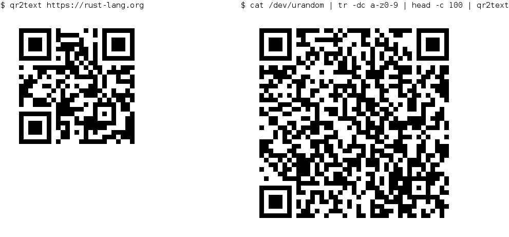

# qr2text

A CLI program to render a QR code as plain text, using [block symbols](https://en.wikipedia.org/wiki/Block_Elements).

## Examples

With a single argument:

    $ qr2text https://rust-lang.org

Reading data from standard input:

    $ cat /dev/urandom | tr -dc a-z0-9 | head -c 200 | qr2text 

---



---

## Build

### From sources

1. Install [Rust](https://www.rust-lang.org/en-US/)

2. Type

    ```bash
    $ cargo build --release
    ```

3. Copy `target/release/qr2text` to `/usr/local/bin`, or any other directory in your `$PATH`.

### From Cargo

1. Install [Rust](https://www.rust-lang.org/en-US/)

2. Type

    ```bash
    $ cargo install qr2text
    ```

### From a compiled binary

You can download a binary (Linux, x86-64) from the [Releases page](https://github.com/ayosec/qr2text/releases).
